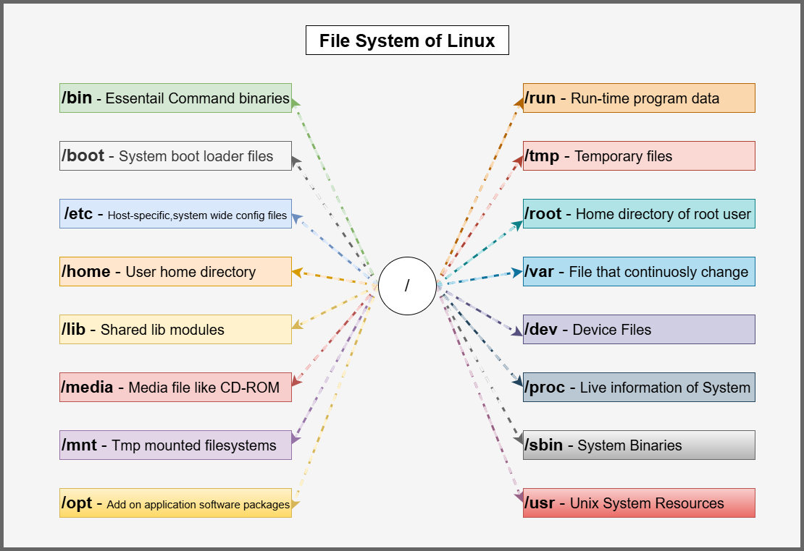

# Linux File System ??

<p align="center">
  
</p>

## Introduction

In Linux, everything is treated as a file.  
The Linux file system is used to organize files and directories in a hierarchical structure.

Linux follows a tree-like structure that starts from the root directory `/`.

---

# Linux File System Structure

```text
        /
       /|\
      / | \
   home etc var
```

The top-most directory is called the **Root Directory**.

---

# Root Directory `/`

The root directory is the starting point of the Linux file system.

All files and directories exist under `/`.

Example:

```bash
cd /
```

---

# Important Linux Directories

| Directory | Purpose |
|---|---|
| / | Root directory |
| /home | User home directories |
| /root | Root user home directory |
| /etc | Configuration files |
| /bin | Basic system commands |
| /sbin | System administration commands |
| /var | Variable data and logs |
| /tmp | Temporary files |
| /usr | User programs and applications |
| /dev | Device files |
| /proc | Process information |
| /boot | Boot loader files |

---

# 1. /home Directory

Contains home directories of normal users.

Example:

```bash
/home/siddharth
```

This is where users store:
- Documents
- Downloads
- Projects
- Scripts

---

# 2. /root Directory

Home directory of the root (admin) user.

Example:

```bash
/root
```

Only root user has access by default.

---

# 3. /etc Directory

Stores system configuration files.

Examples:
- Network configs
- User settings
- Service configs

Example:

```bash
/etc/passwd
```

---

# 4. /bin Directory

Contains essential Linux commands required for system operation.

Examples:

```bash
/bin/ls
/bin/cp
/bin/mkdir
```

---

# 5. /sbin Directory

Contains system administration commands.

Mostly used by root user.

Examples:

```bash
/sbin/reboot
/sbin/fdisk
```

---

# 6. /var Directory

Stores variable data that changes frequently.

Examples:
- Logs
- Cache
- Mail
- Databases

Important log directory:

```bash
/var/log
```

---

# 7. /tmp Directory

Used for temporary files.

Files may get deleted automatically after reboot.

Example:

```bash
/tmp
```

---

# 8. /usr Directory

Contains:
- Applications
- Libraries
- User commands

Example:

```bash
/usr/bin
```

---

# 9. /dev Directory

Contains device files.

Linux treats hardware devices as files.

Examples:

```bash
/dev/sda
/dev/null
```

---

# 10. /proc Directory

Virtual file system containing process and kernel information.

Example:

```bash
/proc/cpuinfo
```

Check CPU details:

```bash
cat /proc/cpuinfo
```

---

# 11. /boot Directory

Contains boot-related files required to start Linux.

Includes:
- Kernel
- Bootloader files

Example:

```bash
/boot
```

---

# Absolute vs Relative Path

## Absolute Path

Starts from root `/`.

Example:

```bash
/home/siddharth/projects
```

---

## Relative Path

Starts from current directory.

Example:

```bash
cd projects
```

---

# Important File System Commands

## pwd
Shows current working directory.

```bash
pwd
```

---

## ls
Lists files and directories.

```bash
ls
ls -l
ls -la
```

---

## cd
Changes directory.

```bash
cd /home
cd ..
```

---

## mkdir
Creates directory.

```bash
mkdir devops
```

---

## touch
Creates empty file.

```bash
touch notes.txt
```

---

## cp
Copies files/directories.

```bash
cp file1.txt file2.txt
```

---

## mv
Moves or renames files.

```bash
mv old.txt new.txt
```

---

## rm
Removes files/directories.

```bash
rm file.txt
rm -rf foldername
```

---

# Hidden Files in Linux

Files starting with `.` are hidden files.

Example:

```bash
.bashrc
.gitconfig
```

Show hidden files:

```bash
ls -la
```

---

# File Permissions Preview

Linux provides:
- Read (r)
- Write (w)
- Execute (x)

Example:

```bash
-rwxr-xr--
```

Permissions are important for:
- Security
- User access control
- Server management

---

# Real-World DevOps Importance ??

Understanding Linux file system is important for:
- Server navigation
- Log troubleshooting
- Configuration management
- Docker & Kubernetes
- CI/CD pipelines
- Monitoring systems

---

# Quick Revision

| Concept | Meaning |
|---|---|
| / | Root directory |
| /home | User files |
| /etc | Configurations |
| /var/log | Logs |
| pwd | Current location |
| ls | List files |
| cd | Change directory |

---

# Summary

The Linux file system organizes all files and directories in a structured hierarchy starting from the root directory `/`.  
Understanding file system structure is essential for Linux administration, DevOps, cloud computing, and troubleshooting.

---

# Author

Siddharth Kanojia  
DevOps & Cloud Learning Journey ??